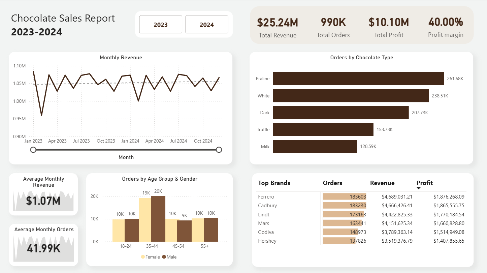

# Chocolate Sales Dashboard

## Project Overview

This project analyzes chocolate sales data for 2023–2024 with Power BI.

The dashboard tracks:

- Revenue
- Profit
- Profit Margin
- Customer Demographics
- Brand Performance
- Product Performance
- Monthly Sales Trends

---

## Dashboard Preview

---

## Tools Used

- Power BI
- Power Query
- DAX
- Excel

---

## Dashboard Features

- Total Revenue KPI
- Total Profit KPI
- Profit Margin KPI
- Average Monthly Revenue
- Average Monthly Orders
- Brand Performance
- Chocolate Type Analysis
- Customer Age Group Analysis
- Year Filter

---

## Key Insights

- Ferrero generated the highest revenue.
- Praline had the highest order volume.
- Customers aged 35–44 placed the most orders.
- Overall profit margin was approximately 40%.

---

## Business Recommendations

- Prioritize inventory for high demand products.
- Target promotions toward the 35–44 customer segment.
- Focus merchandising on top performing brands.
- Investigate recurring monthly revenue declines.

---

## Skills Demonstrated

- Data Cleaning
- Data Modeling
- Power Query
- DAX
- Dashboard Design
- Business Analytics
- KPI Reporting

## Dataset

This project uses the Chocolate Sales Dataset (2023–2024) available on Kaggle.

Due to GitHub file size limitations, the dataset is not included in this repository.

You can download it here:
https://www.kaggle.com/datasets/ssssws/chocolate-sales-dataset-2023-2024
